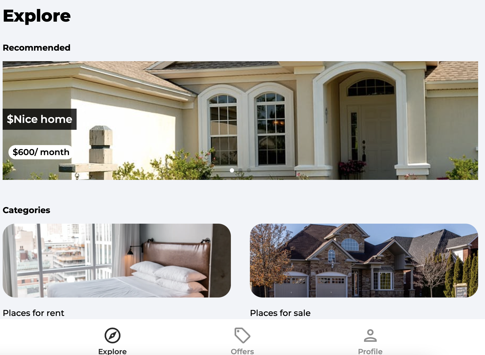
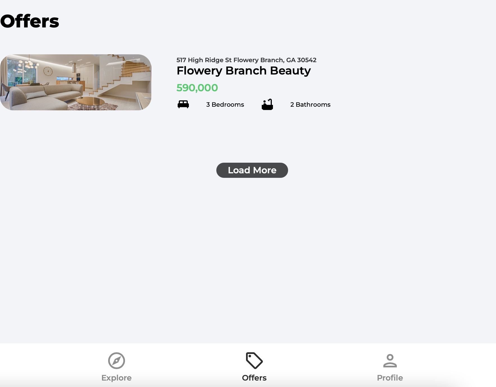
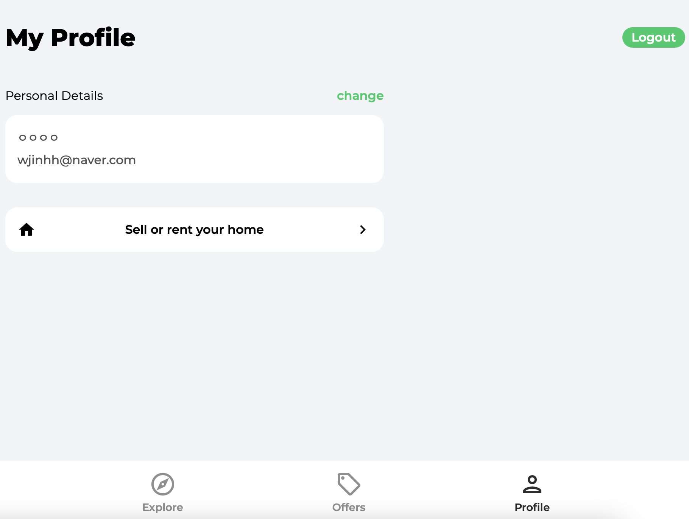

# House Marketplace

React를 사용하여 집을 팔고 살수 있는 서비스 구현

## **🧰 사용기술**

- React, JavaScript, CSS, Firebase

## 📅 프로젝트 기간

- 22.01.09 ~ 22.01.12

## 💻 Visit Project Website

[house-marketplace-react.vercel.app](http://house-marketplace-react.vercel.app/)

## ✨ 목표 서비스 및 실제 구현 정도

1. 회원가입 및 로그인 기능 구현
2. 소셜 로그인 기능 구현(구글)
3. pagination 기능 구현
4. 프로필 페이지
   1. 프로필 페이지에서 회원 정보 변경
   2. 새로운 집 게시글 작성 가능

5. Leaflet을 이용하여 지도 표시

### 기본 화면

### Offers  

### 프로필 페이지

## 느낀점 

Firebase 및 React를 이용하여 프로젝트를 진행했습니다.

Firebase가 생각보다 어려웠고,  리액트 공식문서를 다시 봐야겠다는 필요성을 느꼈다.

완성된 프로젝트는 Vercel을 이용하여 배포하였습니다.
